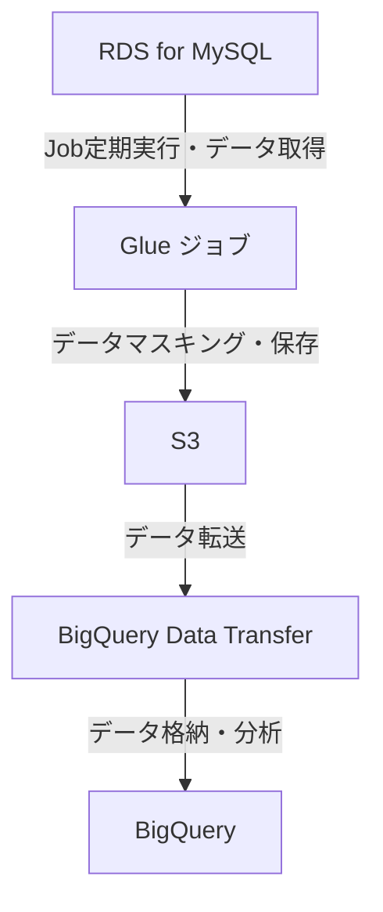

:::message
今日の記事は [Sun\* Advent Calendar 2024](https://adventar.org/calendars/10035) 13 日目です！
:::

# はじめに

こんにちは！
2024 年 4 月から Sun\*でバックエンドエンジニアとして働いている[monokaai](https://github.com/monokaai)こと鈴木康輔です。
入社から早くも半年が経ってしまいました（もう年末だなんて信じられません。。）

Sun\*では、モバイルヘルスケアアプリ開発のプロジェクトに参画してサーバーサイド（主に NestJS）を担当しています。
会員数の増加に伴い、DB データの利活用を促進する目的でデータウェアハウスを構築したいという要望がありました。
初めての経験だったので、要件定義や技術選定で考えたことを中心にまとめます。

# 背景

元々 Python をメイン言語としており、レコメンド施策・分析業務にも 1 年ほど携わっていた時期がありました。インフラ構築の経験はほぼ無く、今のプロジェクト参画後に Terraform で軽微な修正を担当していたくらいでした。
データ分析の業務経験があるメンバーが他にいなかったこともあり、要件定義から関わることができました。

# 要件

クライアントの主な要件は以下でした。

- 社内の別プロジェクトからも参照される可能性があり、直接 DWH には格納せず S3 の経由が必要
- 個人情報保護の観点で、データのマスキングは必須（ユーザー名の除去、誕生日を年代に変換するなど）
- アプリ DB だけでなく、それ以外のデータ連携にも追加対応しやすい構成にしてほしい（当然ですね）

また前提として RDS for MySQL をアプリ DB として利用しており、リードレプリカ上でのデータ分析は DWH 構築以前から行っていました。
アプリからもリードレプリカを利用するのでアクセス集中を避けつつ、エンジニア以外の方でも分析しやすい環境が欲しいというモチベーションもありました。

# 技術選定

最初に考えるのはどのサービスにデータを入れるかだと思います。
AWS には[RedShift](https://aws.amazon.com/jp/redshift/)や[Athena](https://aws.amazon.com/jp/athena/)がありますし、Google Cloud だと[BigQuery](https://cloud.google.com/bigquery?hl=ja)になるでしょう。

アプリインフラが AWS 上に構築されていることと、BigQuery は私含めて利用経験者が数名いて、使い勝手も悪くないことから上記から選定することにし、最終的には BigQuery を選びました。
作成した SQL クエリの保存・共有もでき、テーブル単位での権限設定などデータガバナンスの設定もしやすい点が嬉しいです。

## 最終構成

採用したインフラ構成・処理フローは以下です！かなりシンプルですね。



主に以下のような点に苦労しました。

- データ抽出に利用する Glue を初めて使ったこと
  - [ローカル開発環境の構築](https://docs.aws.amazon.com/ja_jp/glue/latest/dg/aws-glue-programming-etl-libraries.html)の導入がスムーズにいかず、AWS コンソール上での開発がメインになってしまった
  - 並列処理が可能な PySpark 環境でジョブを動かしたが、Pandas の DataFrame と記法が異なり慣れない
  - 上記の組み合わせでデバッグ工数が大きくなってしまった…
- [クロスアカウントアクセス](https://docs.aws.amazon.com/ja_jp/IAM/latest/UserGuide/access_policies-cross-account-resource-access.html)が発生したこともあり、IAM ロールのアクセス権限管理に少し悩んだ

## その他の案

採用はしませんでしたが、以下のような案もありました。
メリット・デメリットや選定の背景を簡単にまとめておきます。

- [Datastream for BigQuery](https://cloud.google.com/datastream-for-bigquery?hl=ja)を使う
  - ⭕️ ニアリアルタイム更新が可能かつオートスケーリングで設定も非常に簡単そう
  - ❌ 今回は S3 を経由する要件にマッチしませんでした。そうした制限がなければ採用したと思います
- AWS Batch + ECS on Fargate でデータ取得・整形を行う
  - ⭕️ DWH 以外の処理も実行したくなった時に任せるためのサーバーを追加できる（Lambda を ECS に置換する話もあったため）
  - ❌ データ分析単体の要件としては構成が複雑になりすぎる
- 分析ツールに Amazon Athena や Redshift Spectrum を使う
  - ⭕️ Google Cloud へのデータ転送が不要で、AWS 側のデータ分析用サービスで完結できる
  - ❌ Athena だとデータガバナンスを単体で定義できず、DB 以外のデータとの連携も面倒になりそう。Redshift(Spectrum)はより柔軟だが、クラスタ管理が必要でコストも高くなる懸念あり

## Glue ジョブの実装

Glue で RDS に接続してデータを取得する処理は、以下のようになりました。
Glue 自体の解説は[AWS Glue 入門（１章 データ基盤と Glue の概要）](https://qiita.com/Mikoto_Hashimoto/items/35b2de805af855b17b6d)がわかりやすく、助けられました！

:::details RDS からデータ取得・整形して S3 に Parquet 形式でエクスポートするコード

```
import sys
from datetime import date
from typing import Dict, Optional, Union

import boto3
from awsglue.context import GlueContext
from awsglue.job import Job
from awsglue.utils import getResolvedOptions
from pyspark.context import SparkContext
from pyspark.sql import DataFrame, SparkSession
from pyspark.sql.functions import col, udf
from pyspark.sql.types import StringType

# 環境変数の取得
args: Dict[str, str] = getResolvedOptions( # Glue ジョブ内で利用したい環境変数を指定
sys.argv,
["JOB_NAME", "env", "region", "output_bucket_name", "connection_name"],
)
env: str = args["env"] if "env" in args else "local"
region_name: str = args["region"] if "region" in args else "ap-northeast-1"
output_bucket_name: str = args["output_bucket_name"]
connection_name: str = args["connection_name"]

# コンテキストやセッションの初期化
glueContext: GlueContext = GlueContext(SparkContext.getOrCreate())
spark: SparkSession = glueContext.spark_session

# Glue データカタログから接続情報を取得
glue_client = boto3.client("glue")
connection = glue_client.get_connection(Name=connection_name)
connection_properties = connection["Connection"]["ConnectionProperties"]
jdbc_url = connection_properties["JDBC_CONNECTION_URL"]
db_user = connection_properties["USERNAME"]
db_pass = connection_properties["PASSWORD"]
db_name = jdbc_url.split("/")[-1]

# ジョブの開始
job = Job(glueContext)
job.init(args["JOB_NAME"], args)

# テーブル一覧を PySpark の DataFrame として取得し、リストに変換
jdbc_url += "?characterEncoding=utf8&useSSL=true&&rewriteBatchedStatements=true"
properties: Dict[str, str] = {
"user": db_user,
"password": db_pass,
"driver": "com.mysql.cj.jdbc.Driver",
}

query = f"(SELECT \* FROM information_schema.tables WHERE table_schema = '{db_name}') AS tables"
tables_df: DataFrame = spark.read.jdbc(url=jdbc_url, table=query, properties=properties)
table_names = tables_df.select("table_name").rdd.flatMap(lambda x: x).collect()
print("Table_names", table_names)

def get_age_group(target_col: Optional[Union[date, str]]) -> str:
"""誕生日を元に年代を取得する関数"""
pass

def mask_and_export(
spark: SparkSession, table: str, jdbc_url: str, properties: Dict[str, str]
) -> None:
df: DataFrame = spark.read.jdbc(url=jdbc_url, table=table, properties=properties)
    # マスキング処理
    if table == "users":
        df = df.withColumn("age_groups", age_decade_udf(col("birthday")))
        df = df.drop("name", "birthday")

    # Parquet形式でエクスポート
    output_path = f"s3://{output_bucket_name}/{table}"
    df.write.mode("overwrite").format("parquet").save(output_path)

age_decade_udf = udf(get_age_group, StringType())

# テーブルごとに S3 へデータをエクスポート
for table in table_names:
mask_and_export(spark, table, jdbc_url, properties)

# ジョブの完了
job.commit()
```

:::

# おわりに

最後まで記事をお読みいただき、ありがとうございました！少しでもお役に立てば嬉しいです。
明日は Tamaki Masanori さんによるプロジェクトマネジメントについてのお話しです。
お楽しみに！
